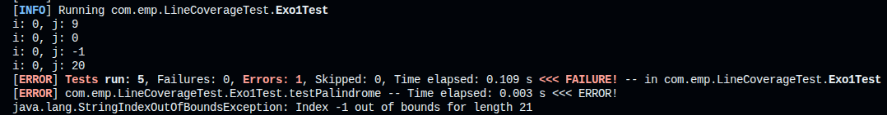
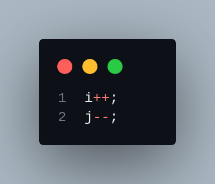
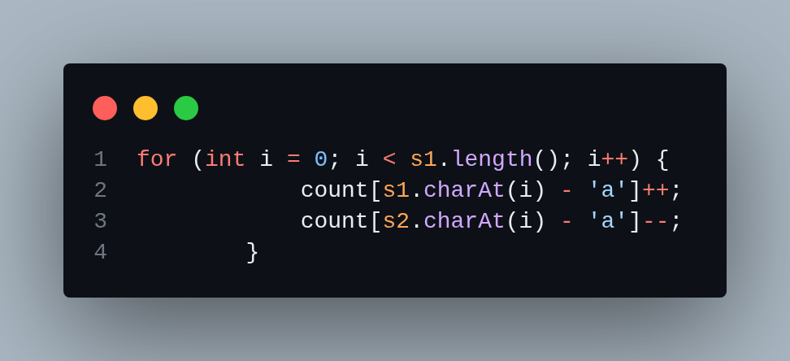

# TP1

## EXO1

### Bugs
 ## 1 : index hors limites

 ### correction :
<!-- reduce image size -->

### EXO 2
 ## 1 : Les chaînes vides résultent en Index 0 hors limites pour une longueur de 0
    ### solution : ajouter une condition pour vérifier si la chaîne est vide avant d'accéder à ses caractères.

 ## 2 : Les anagrammes résultent en Index hors limites
    ### solution : supprimer <= et le remplacer par < dans la condition de la boucle for

### EXO 3
 ## 1 : Les tableaux à un seul élément ne sont pas gérés correctement
    ### solution : changer `low < high` en `low <= high` dans la condition de la boucle while pour gérer correctement les tableaux à un seul élément

### EXO 5
 ## 1 : ArrayIndexOutOfBoundsException lors de l'accès au tableau de symboles
    ### solution : changer `i <= symbols.length` en `i < symbols.length` dans la condition de la boucle for pour éviter d'accéder au tableau hors limites

### EXO 6
 ## 1 : La valeur d'entrée 1 est traitée incorrectement comme invalide
    ### solution : changer `n <= 1` en `n < 1` dans la condition puisque 1 est une entrée valide qui devrait retourner "1"